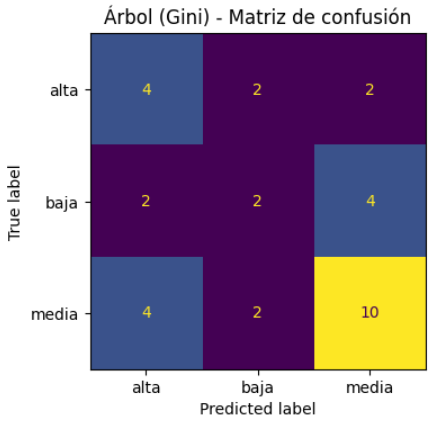
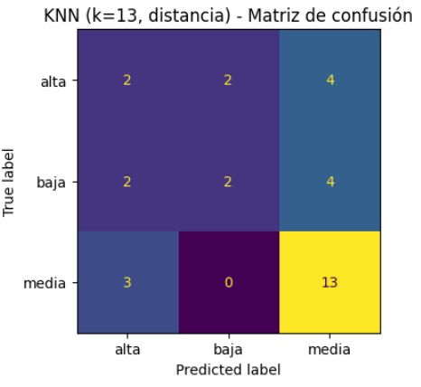

# Book Sales Classification — Decision Tree (Gini) vs KNN 📚🤖

[](https://colab.research.google.com/drive/1cq5CCFyvduj9FyCeJRLM5VWqUJzl20vH?usp=sharing)

---

## Overview

This project compares two classification algorithms — **Decision Tree (Gini)** and **K-Nearest Neighbors (KNN)** — to predict the **sales level** of technical books.

The target variable is the number of copies sold, transformed into **three classes**:

- `baja`  – low sales  
- `media` – medium sales  
- `alta`  – high sales  

The goal is not only to train models, but to **understand their limitations given the data** and to practice a full ML workflow: data preparation, modeling, evaluation and business-style interpretation.

---

## Dataset

The dataset contains information about technical books and their online performance.

- **Source**: cleaned spreadsheet `trabajo_limpio.xlsx` (notebook downloads it from Google Drive).
- **Main features:**
  - `prom_palabras` – average number of words per book
  - `links_referencias` – number of reference links
  - `criticas_negativas` – number of negative reviews
  - `presentaciones_video` – number of video presentations
- **Target (continuous):** `copias_vendidas` – number of copies sold

To build a classification problem, `copias_vendidas` is binned using **percentiles 25 and 75**:

- `baja`  if copies ≤ p25  
- `media` if p25 < copies ≤ p75  
- `alta`  if copies > p75  

This replaces a simple split into equal thirds, which performed worse.

> For GitHub, a reduced sample can be stored as  
> `data/sample/book_sales_sample.xlsx` or `.csv` for quick testing.

---

## Methodology

- **Train/test split:** 80% train / 20% test, **stratified** by class.
- **Imputation:** median imputation on missing values.
- **Class imbalance:** for the tree, `class_weight="balanced"` is used.
- **Scaling:** only applied to KNN via `StandardScaler` (distance-based model).
- **Random seed:** `SEED = 42` for reproducibility.

Two `scikit-learn` **pipelines** are defined:

1. **Decision Tree (Gini)**  
   - `SimpleImputer(strategy="median")`  
   - `DecisionTreeClassifier(criterion="gini", max_depth=3, min_samples_leaf=8, class_weight="balanced")`

2. **KNN (k = 13, distance)**  
   - `SimpleImputer(strategy="median")`  
   - `StandardScaler()`  
   - `KNeighborsClassifier(n_neighbors=13, weights="distance", metric="minkowski", p=2)`

Evaluation metrics:

- **Accuracy**
- **F1-macro**
- Classification report
- Confusion matrix

---

## Results

### Model comparison

| Model                      | Accuracy | F1-macro |
|---------------------------|:--------:|:--------:|
| Decision Tree (Gini)      | 0.500    | 0.452    |
| KNN (k = 13, distance)    | 0.531    | 0.434    |

Key points:

- Both models perform similarly, around **50% accuracy**.
- The **Decision Tree** achieves slightly better **F1-macro**  
  (better balance across classes), while **KNN** gets a bit more accuracy.
- The **extreme classes** (`baja`, `alta`) are the hardest; `media` is easier to recover.
- In the tree, **`links_referencias`** and **`criticas_negativas`** appear as the most influential features.

### Decision Tree (Gini)

Accuracy: **0.500**  
F1-macro: **0.452**



- Le cuesta sobre todo distinguir entre **baja** y **alta**.
- La clase **media** es la que mejor se recupera.

---

### KNN (k = 13, distance)

Accuracy: **0.531**  
F1-macro: **0.434**



- Mejora un poco la **accuracy**, pero sigue habiendo confusión entre clases extremas.
- La clase **media** vuelve a ser la más fácil de predecir.


---

## Interpretation

The performance (accuracy ≈ 0.50, F1-macro ≈ 0.45) is **moderate** and mainly limited by the data, not by the algorithms:

- **Few observations:** little evidence to learn robust patterns.
- **Low correlation with the target:** some features (e.g. `presentaciones_video`) carry weak signal.
- **Fuzzy class boundaries:** percentile cuts (p25/p75) generate overlap, especially for the `media` class.
- **Class imbalance:** even with `class_weight="balanced"`, the extreme classes suffer.
- **Noise/variability:** small changes in features do not always reflect real changes in sales.

Both models capture some structure (they beat the 33% random baseline for 3 classes),  
but they **do not reach a level suitable for production use**.

---

## Recommendations

To improve the model in a realistic scenario:

- **Collect more data** (more books / time periods).
- **Add new features**: book type and genre, price, promotions, seasonality, marketing campaigns, etc.
- **Re-engineer the target**: alternative ways to define classes that better separate low/medium/high sales.
- **Rebalance and transform**: resampling techniques, log-transform of target before binning, etc.

In short, the main bottleneck is **data quality and richness**, not model complexity.

---

## How to Run

```bash
pip install -r requirements.txt
jupyter notebook notebooks/book_sales_tree_vs_knn.ipynb
```
## 📜 License
MIT License — This project is for educational and portfolio purposes.
